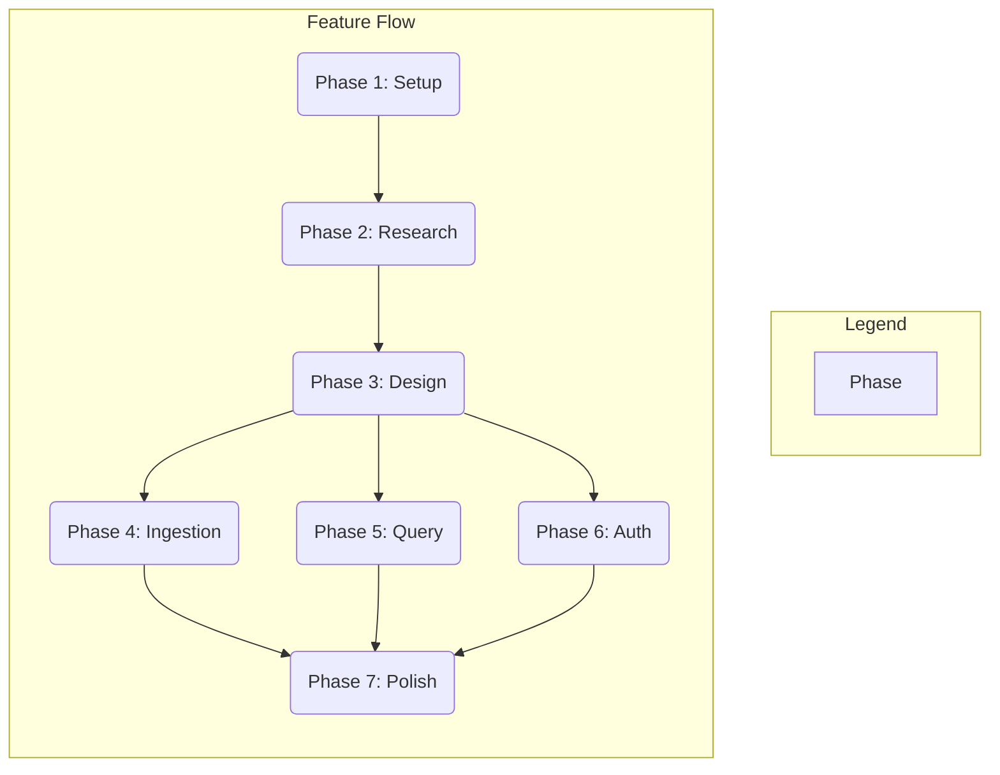

# Task Breakdown: Normalize Backend Architecture

**Feature**: `001-normalize-backend-arch`
**Date**: 2025-12-07

This document breaks down the implementation of the normalized backend architecture into actionable, dependency-ordered tasks.

## Phase 1: Setup (Shared Infrastructure Adaptation)

**Purpose**: Adapt existing project setup to the new architectural decisions.

- [x] T001 Update `requirements.txt` in `backend/` to ensure all necessary libraries for PostgreSQL (SQLAlchemy, asyncpg, Alembic) are present.
- [x] T002 Update `.env.example` in `backend/` to reflect all necessary environment variables for PostgreSQL and Qdrant.
- [x] T003 Review and adapt the main application entrypoint (`backend/src/main.py`) and configuration module (`backend/src/core/config.py`) to handle the new PostgreSQL database connection and configurations.

## Phase 2: Research & Outline (Phase 0 in Plan)

**Purpose**: Resolve "Unknowns / Needs Clarification" identified in the Implementation Plan.

- [x] T004 [P] Research optimal hosting environment/platform for FastAPI backend and document findings in `research.md`.
- [x] T005 [P] Research detailed error handling and retry mechanisms for external API failures (PostgreSQL, Qdrant, LLMs) and document findings in `research.md`.
- [x] T006 [P] Research detailed observability requirements (metrics, alerting, monitoring tools) for the normalized backend and document findings in `research.md`.
- [x] T007 Consolidate findings from research tasks (T004-T006) into `research.md`.

## Phase 3: Design & Contracts (Phase 1 in Plan)

**Purpose**: Translate clarified requirements and research findings into detailed design artifacts for the normalized architecture.

- [x] T008 Define FastAPI application structure, incorporating PostgreSQL for user/metadata management, and document in `data-model.md`.
- [x] T009 Design data models for user accounts and document metadata in PostgreSQL, based on the schema in `spec.md`, and document in `data-model.md`.
- [x] T010 Define how Qdrant integration will specifically handle vector embeddings with links to PostgreSQL metadata, and document in `data-model.md`.
- [x] T011 Define API endpoints and their request/response schemas, ensuring consistency with the normalized architecture, and generate OpenAPI/GraphQL schemas in `contracts/`.
- [x] T012 Implement initial PostgreSQL client setup and ORM integration (SQLAlchemy, asyncpg), and document basic usage in `quickstart.md`.
- [x] T013 Draft a quickstart guide for local setup and basic usage, reflecting the normalized architecture, in `quickstart.md`.
- [x] T014 Update agent context with new technology and API details.

## Phase 4: User Story 1 - Consistent Data Storage for Ingestion (US1)

**Goal**: Implement the ingestion process to reliably store document metadata in PostgreSQL and vector embeddings in Qdrant.
**Independent Test**: Perform document ingestion and verify that metadata is stored exclusively in PostgreSQL and embeddings exclusively in Qdrant, without cross-contamination or errors.

- [x] T015 [US1] Implement PostgreSQL schema and migrations for document metadata (`chunk_metadata_table`) and user accounts in `backend/src/models/`.
- [x] T016 [US1] Update ingestion logic in `backend/src/api/ingest.py` to persist document metadata in PostgreSQL and vector embeddings in Qdrant.
- [x] T017 [US1] Implement transactional consistency mechanisms between PostgreSQL and Qdrant during ingestion.
- [x] T018 [US1] Develop unit and integration tests for consistent data storage during ingestion in `backend/tests/`.

## Phase 5: User Story 2 - Consistent Data Retrieval for Query (US2)

**Goal**: Implement queries to retrieve information by correctly accessing document metadata from PostgreSQL and vector embeddings from Qdrant.
**Independent Test**: Perform queries and observe that data access patterns correctly segregate retrieval of metadata from PostgreSQL and embeddings from Qdrant.

- [x] T019 [US2] Update query logic in `backend/src/api/query.py` to retrieve document metadata from PostgreSQL.
- [x] T020 [US2] Ensure vector searches against Qdrant are correctly linked to PostgreSQL metadata.
- [x] T021 [US2] Develop unit and integration tests for consistent data retrieval during query in `backend/tests/`.

## Phase 6: User Story 3 - Consistent User Authentication (US3)

**Goal**: Implement user authentication and account information managed exclusively and consistently in PostgreSQL.
**Independent Test**: Perform user registration, login, and profile updates, verifying all user account data is managed solely within PostgreSQL.

- [x] T022 [US3] Implement FastAPI endpoints for user registration, login, and profile management using PostgreSQL in `backend/src/api/`.
- [x] T023 [US3] Implement PostgreSQL interactions for user credential verification and account management.
- [x] T024 [US3] Develop unit and integration tests for user authentication in `backend/tests/`.

## Phase 7: Polish & Cross-Cutting Concerns (Phase 3 in Plan)

**Purpose**: Deployment, observability, and finalization for the normalized backend.

- [x] T025 Develop deployment scripts/configurations based on hosting research.
- [ ] T026 Implement comprehensive monitoring and alerting based on observability research.
- [x] T027 Set up CI/CD pipeline for the normalized backend.
- [ ] T028 Add comprehensive docstrings and type hints to all new/modified modules.
- [x] T029 Update `README.md` with setup and usage instructions for the normalized architecture.
- [ ] T030 Run a final `pytest` and `ruff check .` on the `backend/` directory and ensure all tests pass.

## Dependencies

- **Setup (Phase 1)**: No dependencies - can start immediately.
- **Research & Outline (Phase 2)**: Depends on Setup completion.
- **Design & Contracts (Phase 3)**: Depends on Research & Outline completion.
- **User Stories (Phase 4, 5, 6)**: All depend on Design & Contracts completion. These can proceed in parallel.
- **Polish & Cross-Cutting Concerns (Phase 7)**: Depends on all User Stories being complete.

## Implementation Strategy

### MVP First (Consistent Ingestion Only)

1. Complete Phase 1: Setup
2. Complete Phase 2: Research & Outline
3. Complete Phase 3: Design & Contracts
4. Complete Phase 4: User Story 1 (Consistent Data Storage for Ingestion)
5. **STOP and VALIDATE**: Test User Story 1 independently.

### Incremental Delivery

1. Complete Setup, Research, Design → Foundation ready for implementation.
2. Add User Story 1 → Test independently → Deploy/Demo.
3. Add User Story 2 → Test independently → Deploy/Demo.
4. Add User Story 3 → Test independently → Deploy/Demo.
5. Each story adds value without breaking previous stories.

### Parallel Team Strategy

With multiple developers:

1. Team completes Setup, Research, Design together.
2. Once Design is done:
   - Developer A: User Story 1 (Ingestion)
   - Developer B: User Story 2 (Query)
   - Developer C: User Story 3 (Authentication)
3. Stories complete and integrate independently.

## Notes

- [P] tasks = different files, no dependencies
- [Story] label maps task to specific user story for traceability
- Each user story should be independently completable and testable
- Verify tests fail before implementing
- Commit after each task or logical group
- Stop at any checkpoint to validate story independently
- Avoid: vague tasks, same file conflicts, cross-story dependencies that break independence